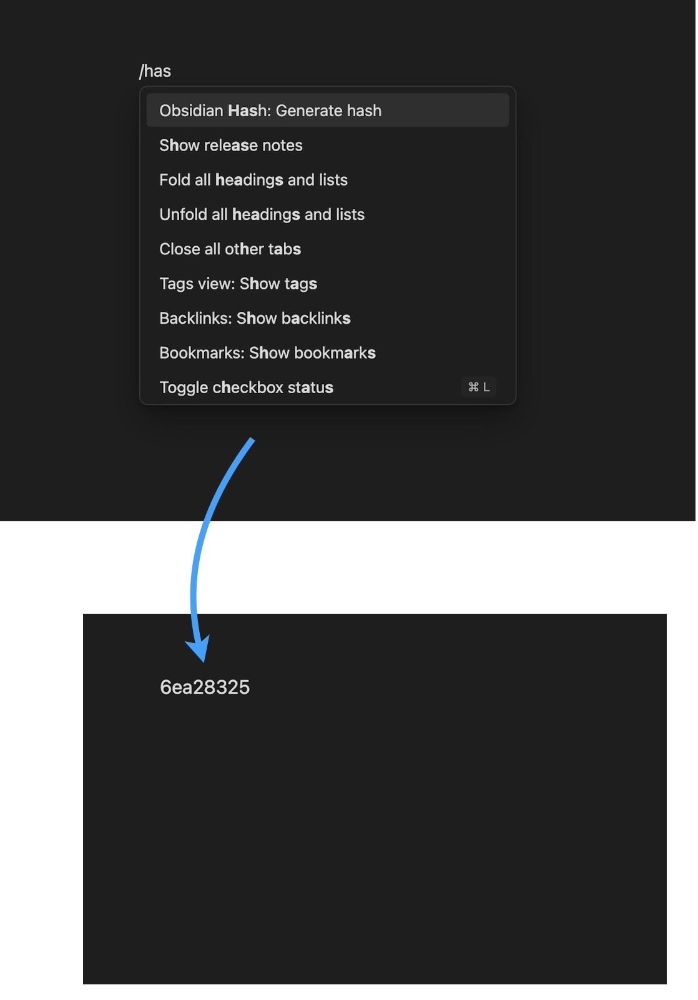
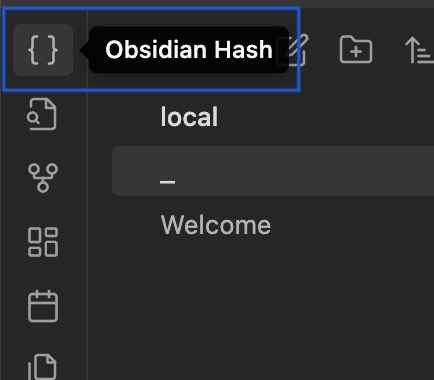

# Obsidian Generate Hash Plugin

A small plugin for generating a cryptographically strong pseudorandom hash value using [`crypto.randomBytes`](https://nodejs.org/api/crypto.html#cryptorandombytessize-callback). Useful for generating unique IDs. 

See this [stackoverflow comment](https://stackoverflow.com/questions/9407892/how-to-generate-random-sha1-hash-to-use-as-id-in-node-js/14869745#14869745) for background information.

### Usage

Consists of a single command, `Generate hash`, which can be invoked from the command pallette or from the `{}` button in the left ribbon.

### Settings

#### Hash size

An integer between `1` and `2**31 - 1` specifying the number of bytes to generate. Defaults to `6`.

